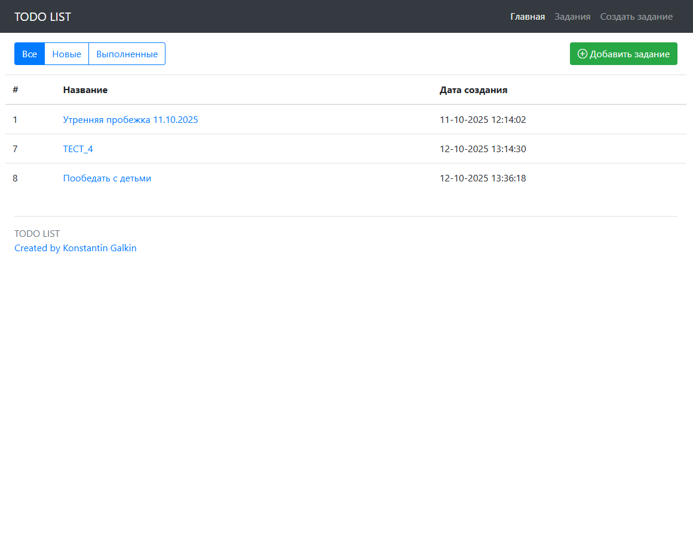
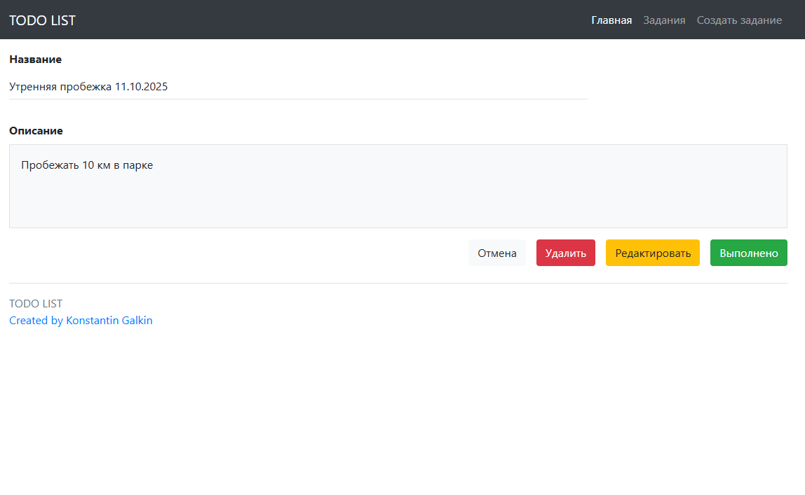

# TODO List Application

## Описание
Веб-приложение для управления задачами (TODO список) с полным CRUD функционалом. 
Позволяет эффективно организовывать и отслеживать выполнение задач.

## 🚀 Функциональность
- ✅ **Просмотр задач** - список всех задач с основной информацией
- 🔍 **Фильтрация** - просмотр задач по статусу (Все/Новые/Выполненные)
- ➕ **Создание задач** - добавление новых задач с названием и описанием
- ✏️ **Редактирование задач** - полное изменение существующих задач
- ✅ **Отметка выполнения** - изменение статуса задачи на "Выполнено"
- 🗑️ **Удаление задач** - удаление ненужных задач
- 👀 **Детальный просмотр** - полная информация о задаче на отдельной странице

## 🛠 Технологический стек
- **Backend Framework**: Spring Boot 2.7+
- **Database**: PostgreSQL
- **ORM**: Hibernate
- **Templating**: Thymeleaf
- **Frontend**: Bootstrap
- **Build Tool**: Maven
- **Java Version**: 17+

## 🖼️ Демонстрация интерфейса

### Главная страница со списком задач

*Таблица с задачами и панель фильтрации*

### Детальный просмотр задачи

*Полная информация о задаче и кнопки действий*
